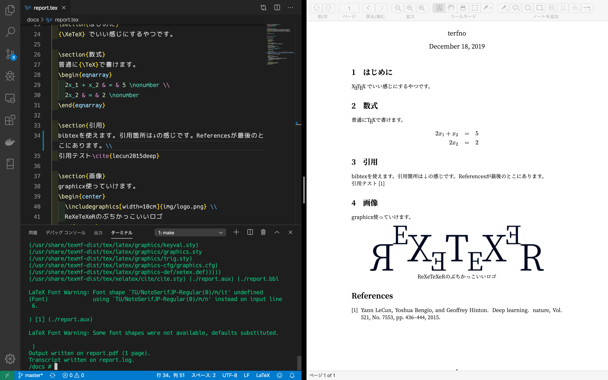

# ReXeTeXeR

  

## これはなに

動作イメージ(スクショは開発中のもの)
 

日本語の `.tex` (UTF-8) を TeX の環境構築なしに、XeTeX(xelatex)を使って `.pdf` に変換する Docker のコンテナーを作れるファイル群です。勝手に**ReXeTeXeR**と名前をつけました。pBibTeX による Reference の自動生成に対応してます。

## 古事記

// もしこの ReXeTeXeR が役に立ったらなんか贈ってもらえると私の励みになります。

- [my Amazon wish list of books](https://www.amazon.co.jp/hz/wishlist/ls/3F249ZYIVVASC/ref=nav_wishlist_lists_2?_encoding=UTF8&type=wishlist)
- [my Amazon wish list of gadget](https://www.amazon.co.jp/hz/wishlist/ls/21AZUN2VWHY3C/ref=nav_wishlist_lists_3?_encoding=UTF8&type=wishlist)
- [my Amazon wish list(tea, game, etc)](https://www.amazon.co.jp/hz/wishlist/ls/27B0W5F7BN0VF/ref=nav_wishlist_lists_4?_encoding=UTF8&type=wishlist)

## 感謝

- cite.sty: mirrors.ctan.org/macros/latex/contrib/cite/cite.sty
- junsrt.bst: http://mirror.las.iastate.edu/tex-archive/biblio/pbibtex/base/junsrt.bst
- BXjscls: https://github.com/zr-tex8r/BXjscls
- ZXjatype: https://github.com/zr-tex8r/ZXjatype